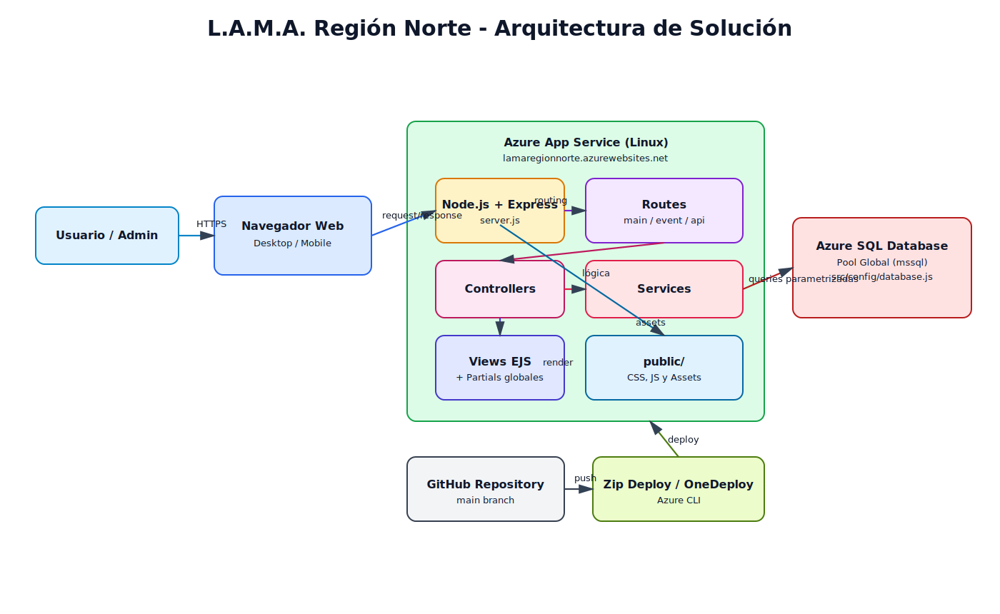
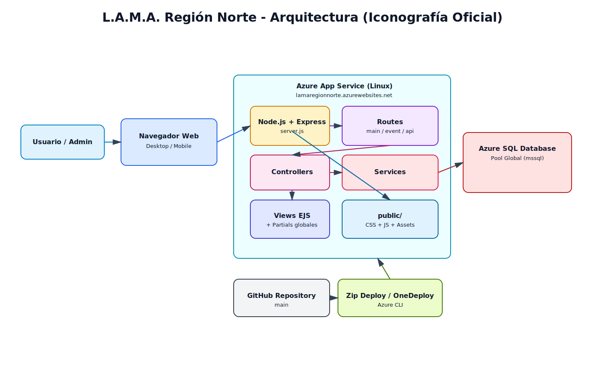
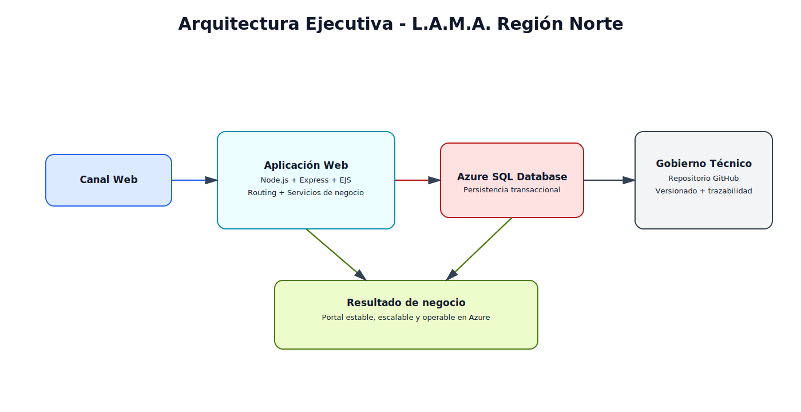
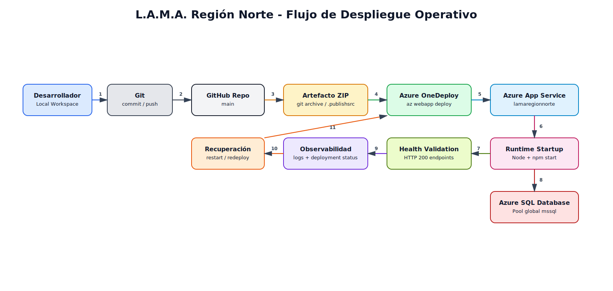
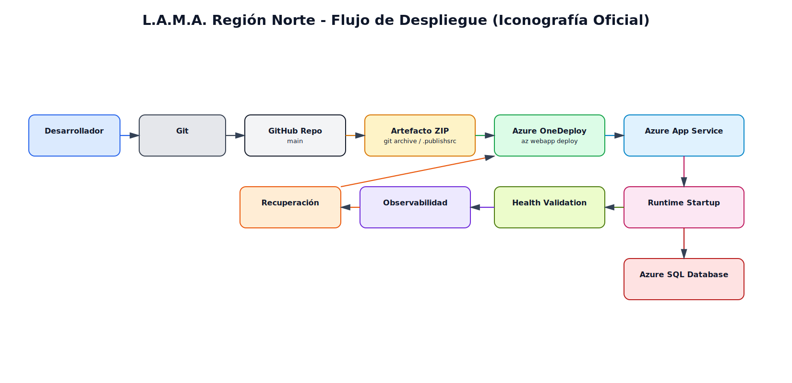
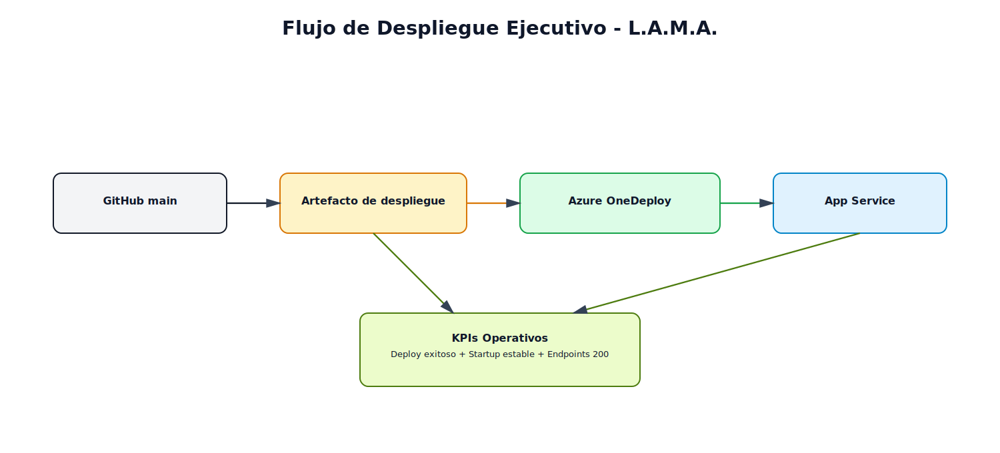
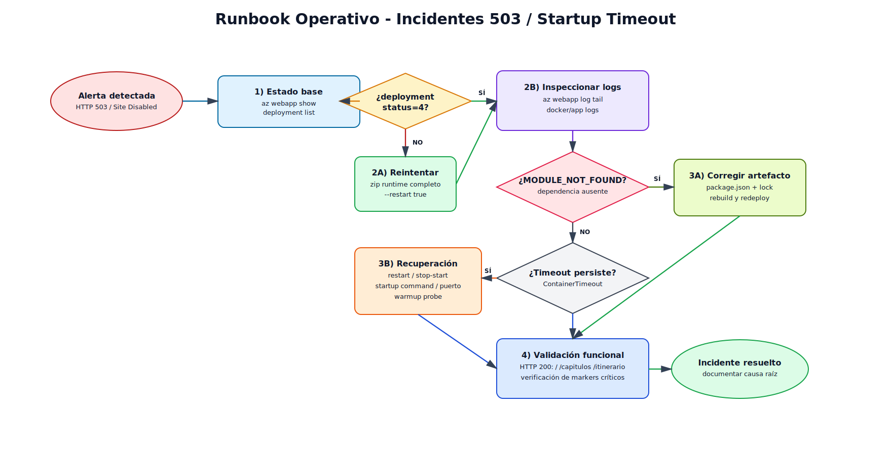
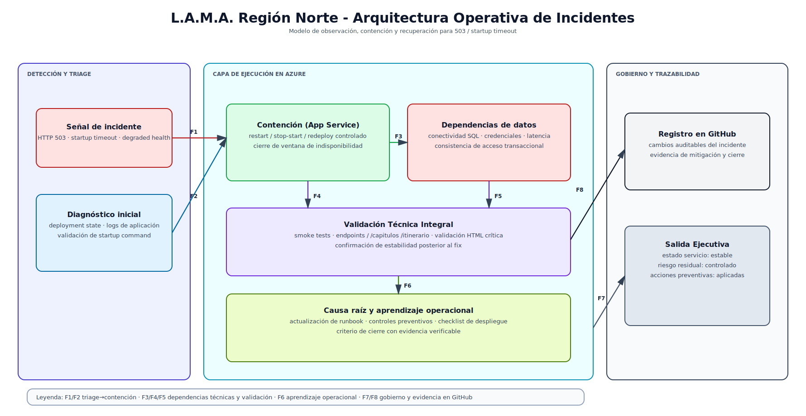
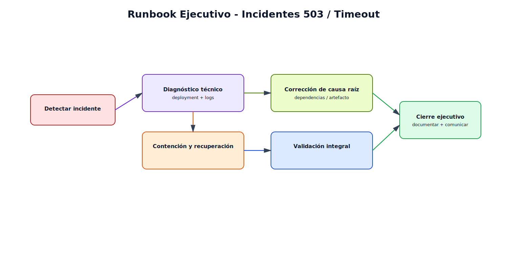

# L.A.M.A. Hardcore Tropical - Web App Full Stack

Web App Full Stack con estilo visual "Hardcore Tropical" para L.A.M.A. Región Norte, desarrollada con Node.js, Express y Tailwind CSS.

## Identidad Visual

### Paleta de Colores

- **lamaBlack** `#0A0A0A` - Fondo principal (asfalto)
- **lamaDark** `#1A1A1A` - Contenedores y secciones
- **lamaGold** `#D4AF37` - Dorado lujo y victoria
- **lamaNeon** `#00F5FF` - Turquesa neón (Mar de los 7 Colores)
- **lamaBone** `#F5F5DC` - Texto principal

### Tipografías

- **Bebas Neue** - Títulos (tracking-widest)
- **Montserrat** - Cuerpo de texto
- **Rock Salt** - Acentos tropicales

### Efectos CSS

- `.neon-text` - Text-shadow turquesa multicapa
- `.gold-text` - Gradiente lineal dorado
- Navegación sticky con backdrop-blur
- Shadow-xl en secciones principales

## Arquitectura

> Nota: Las variantes **con iconos oficiales** usan activos del repositorio `dwarfered/azure-architecture-icons-for-drawio` (Azure) y `GitHub Mark` oficial.

> Trazabilidad de fuentes: `docs/icons-official/SOURCES.md`
> Guía para edición visual en Draw.io con stencils oficiales: `docs/DRAWIO-STENCILS-OFICIALES.md`

### Diagrama de Solución



**Versión con iconos oficiales:**



- Fuente editable Draw.io (iconos): `docs/arquitectura-solucion-iconos.drawio`

**Versión ejecutiva (presentación):**



- Fuente editable Draw.io (ejecutivo): `docs/arquitectura-solucion-ejecutivo.drawio`

- Fuente editable Draw.io: `docs/arquitectura-solucion.drawio`

### Diagrama de Despliegue Operativo



**Versión con iconos oficiales:**



- Fuente editable Draw.io (iconos): `docs/flujo-despliegue-operativo-iconos.drawio`

**Versión ejecutiva (presentación):**



- Fuente editable Draw.io (ejecutivo): `docs/flujo-despliegue-operativo-ejecutivo.drawio`

- Fuente editable Draw.io: `docs/flujo-despliegue-operativo.drawio`

### Runbook de Incidentes (503 / Startup Timeout)



**Versión con iconos oficiales:**



- Fuente editable Draw.io (iconos): `docs/runbook-incidentes-operativos-iconos.drawio`

**Versión ejecutiva (presentación):**



- Fuente editable Draw.io (ejecutivo): `docs/runbook-incidentes-operativos-ejecutivo.drawio`

- Fuente editable Draw.io: `docs/runbook-incidentes-operativos.drawio`

```
/
├── src/
│   ├── config/           # Configuración de infraestructura
│   │   └── database.js   # Conexión Azure SQL (mssql)
│   ├── controllers/      # Capa de Aplicación
│   │   ├── mainController.js
│   │   ├── eventController.js
│   │   └── inscripcionController.js
│   ├── services/         # Capa de Dominio (lógica de negocio)
│   │   ├── mainService.js
│   │   ├── eventService.js
│   │   └── inscripcionService.js
│   ├── models/           # Modelos de datos (Azure SQL)
│   │   └── inscripcionModel.js
│   ├── validators/       # Validaciones con Joi
│   │   └── inscripcionValidator.js
│   ├── routes/           # Capa de Presentación
│   │   ├── mainRoutes.js
│   │   ├── eventRoutes.js
│   │   └── apiRoutes.js
│   └── views/            # Plantillas EJS
│       ├── partials/
│       ├── events/
│       └── *.ejs
├── docs/                 # Documentación
│   ├── API.md
│   └── AZURE_SETUP.md
├── public/               # Recursos estáticos
├── server.js             # Punto de entrada
├── package.json
└── .env
```

### Principios de Clean Architecture aplicados

1. **Separación de capas**: Presentación, Aplicación, Dominio, Infraestructura
2. **Dependencias unidireccionales**: Controllers → Services → Models
3. **Lógica de negocio aislada** en servicios
4. **Validación en capa separada** con Joi
5. **Configuración centralizada** para Azure SQL
6. **Rutas como puntos de entrada** claros

## Instalación

```bash
# Instalar dependencias
npm install

# Iniciar en modo desarrollo
npm run dev

# Iniciar en producción
npm start
```

## Variables de Entorno

Crear archivo `.env`:

```env
PORT=3000
NODE_ENV=development
APP_NAME="L.A.M.A. Hardcore Tropical"

# Azure SQL Database
AZURE_SQL_SERVER=your-server.database.windows.net
AZURE_SQL_DATABASE=lama_db
AZURE_SQL_USER=sqladmin
AZURE_SQL_PASSWORD=your-secure-password
AZURE_SQL_PORT=1433
AZURE_SQL_ENCRYPT=true
```

[Ver guía completa de configuración de Azure](docs/AZURE_SETUP.md)

## Rutas Disponibles

### Rutas Principales

- `GET /` - Landing page
- `GET /club` - Información del club
- `GET /contacto` - Formulario de contacto
- `POST /contacto` - Envío de contacto

### Rutas de Eventos

- `GET /eventos` - Listado de eventos
- `GET /eventos/:id` - Detalle de evento
- `POST /eventos/:id/registro` - Inscripción a evento

### API REST (Azure SQL)

- `GET /api/health` - Health check y estado de BD
- `POST /api/register` - Registrar inscripción (validación Joi)
- `GET /api/inscripciones` - Obtener todas las inscripciones
- `GET /api/inscripciones/:documento` - Buscar por documento
- `GET /api/estadisticas` - Estadísticas de inscripciones

[Ver documentación completa de la API](docs/API.md)

## Stack Tecnológico

- **Backend**: Node.js + Express
- **Template Engine**: EJS
- **Styling**: Tailwind CSS (CDN)
- **Base de Datos**: Azure SQL Database (mssql)
- **Validación**: Joi
- **Arquitectura**: Clean Architecture
- **Middleware**: CORS, Body-Parser

## Características

Diseño responsivo (mobile-first)
Navegación sticky con backdrop-blur
Efectos neon y gold-text
Sistema de eventos con inscripción
Formulario de contacto funcional
**API REST con Azure SQL Database**
**Validación robusta con Joi**
**Conexión segura con variables de entorno**
**Modelo de inscripciones completo**
**Health checks y estadísticas**
Arquitectura escalable (Clean Architecture)
Código documentado en español técnico

## Licencia

MIT License - L.A.M.A. Región Norte © 2026
